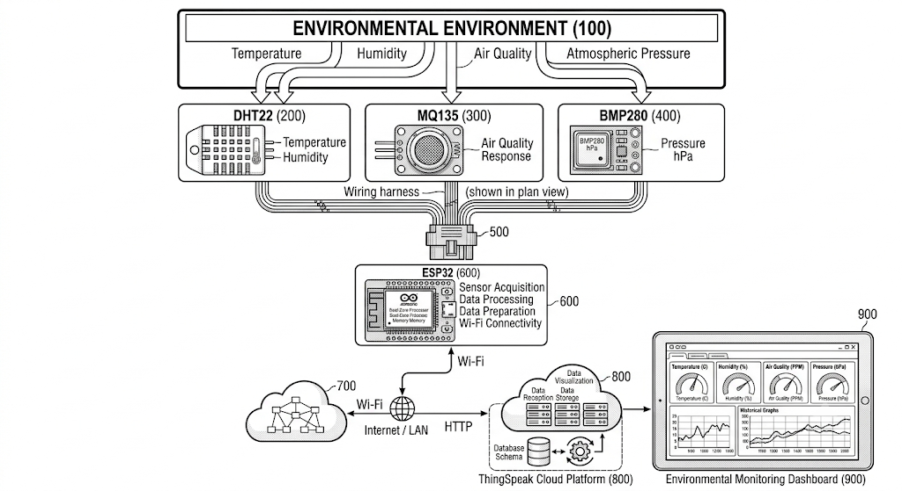
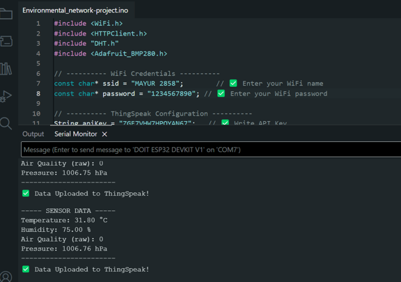

# 🌍 IoT-Based Multi-Parameter Environmental Monitoring System

An **ESP32-based IoT environmental monitoring system** that collects multiple environmental parameters using DHT22, MQ135, and BMP280 sensors and uploads the measurements to the **ThingSpeak cloud platform** through Wi-Fi and HTTP for remote visualization and historical monitoring.

### 🛠️ Tech Stack

`ESP32` `DHT22` `MQ135` `BMP280` `Arduino IDE` `Wi-Fi` `HTTP` `ThingSpeak`

---

## 📌 Overview

Environmental conditions such as temperature, humidity, air-quality sensor response, and atmospheric pressure can change continuously.

This project integrates multiple environmental sensors with an **ESP32 microcontroller** to create a compact IoT monitoring node.

The ESP32 collects sensor measurements, processes the readings, connects to a Wi-Fi network, and transmits the data to **ThingSpeak** using HTTP. The collected data can then be visualized remotely through ThingSpeak dashboards and historical time-series graphs.

### Parameters Monitored

| Parameter | Sensor | Unit |
|---|---|---|
| 🌡️ Temperature | DHT22 | °C |
| 💧 Relative Humidity | DHT22 | % |
| 🌫️ MQ135 Raw Sensor Response | MQ135 | ADC |
| 🌍 Atmospheric Pressure | BMP280 | hPa |

> **Note:** The MQ135 value represents the sensor's raw analog response. The current implementation does **not** convert the reading into calibrated gas concentration values in ppm.

---

# 🎯 Project Objectives

The main objectives of this project are:

1. Monitor multiple environmental parameters using a single IoT device.
2. Measure temperature using the DHT22 sensor.
3. Measure relative humidity using the DHT22 sensor.
4. Acquire the raw analog response of the MQ135 sensor.
5. Measure atmospheric pressure using the BMP280 sensor.
6. Process sensor measurements using an ESP32 microcontroller.
7. Establish wireless connectivity using Wi-Fi.
8. Transmit environmental measurements using HTTP.
9. Upload sensor data to the ThingSpeak cloud platform.
10. Provide remote visualization of environmental measurements.
11. Monitor historical environmental data using time-series graphs.
12. Provide a modular architecture that can be extended with additional sensors.

---

# 🏗️ System Architecture




### System Architecture Flow

```text
                 ENVIRONMENT
                     │
        ┌────────────┼────────────┐
        │            │            │
      DHT22         MQ135       BMP280
        │            │            │
        └────────────┼────────────┘
                     │
                     ▼
              ┌─────────────┐
              │    ESP32    │
              │             │
              │ Sensor      │
              │ Acquisition │
              │ Processing  │
              │ Wi-Fi       │
              └──────┬──────┘
                     │
                  HTTP/Wi-Fi
                     │
                     ▼
              ┌─────────────┐
              │ ThingSpeak  │
              │    Cloud    │
              └──────┬──────┘
                     │
                     ▼
              ┌─────────────┐
              │  Dashboard  │
              │             │
              │ Temperature │
              │ Humidity    │
              │ MQ135 ADC   │
              │ Pressure    │
              └─────────────┘
```

---

# 🔄 Data Flow

The complete data pathway is:

```text
Environmental Conditions
          ↓
       Sensors
          ↓
        ESP32
          ↓
   Sensor Processing
          ↓
      Wi-Fi Network
          ↓
      HTTP Request
          ↓
      ThingSpeak
          ↓
   Cloud Data Storage
          ↓
   ThingSpeak Dashboard
          ↓
   Remote Monitoring
```

### Data Flow Explanation

1. Environmental conditions are detected by the connected sensors.
2. The DHT22 measures temperature and relative humidity.
3. The MQ135 produces a raw analog sensor response.
4. The BMP280 measures atmospheric pressure.
5. The ESP32 reads and processes the sensor measurements.
6. The ESP32 connects to the configured Wi-Fi network.
7. The measurements are transmitted to ThingSpeak through HTTP.
8. ThingSpeak receives and stores the measurements.
9. The ThingSpeak dashboard displays the collected data.
10. Historical measurements can be viewed using time-series graphs.

---

# 🔧 Hardware Components

| Component | Function |
|---|---|
| **ESP32** | Main microcontroller, sensor processing, and Wi-Fi communication |
| **DHT22** | Temperature and relative humidity measurement |
| **MQ135** | Raw analog air-quality sensor response |
| **BMP280** | Atmospheric pressure measurement |
| **Breadboard** | Hardware prototyping |
| **Jumper Wires** | Electrical connections |
| **USB Cable** | Programming and power |

---

# 💻 Software & Technologies

| Technology | Purpose |
|---|---|
| **Arduino IDE** | Firmware development and upload |
| **Embedded C/C++** | ESP32 firmware |
| **ESP32 Arduino Core** | ESP32 development support |
| **Wi-Fi** | Wireless connectivity |
| **HTTP** | Cloud data transmission |
| **ThingSpeak** | Cloud storage and visualization |

---

# 🌡️ Sensors

## DHT22

The **DHT22** is a digital environmental sensor used to measure:

- 🌡️ Temperature
- 💧 Relative humidity

The ESP32 reads both parameters and uploads them to ThingSpeak.

---

## 🌫️ MQ135

The **MQ135** is an analog gas/air-quality sensing module.

In this project, the sensor output is recorded as:

> **Raw MQ135 ADC response**

The current implementation does not directly calculate gas concentration in ppm.

### Why Raw ADC?

MQ135 readings depend on several factors, including:

- Sensor calibration
- Sensor preheating
- Load resistance
- Environmental conditions
- Gas composition
- Sensor characteristics
- Sensor aging

Therefore, a calibrated MQ135 implementation would be required for quantitative gas concentration measurements.

---

## 🌍 BMP280

The **BMP280** is a digital pressure sensor used to measure atmospheric pressure.

The pressure measurement is reported in:

**hPa — hectopascals**

---

# 🔌 Hardware Connections

The following represents the sensor connection arrangement used by the prototype.

## DHT22

```text
DHT22
├── VCC  → ESP32 3.3V
├── GND  → ESP32 GND
└── DATA → ESP32 GPIO
```

## MQ135

```text
MQ135
├── VCC  → Appropriate Power Supply
├── GND  → ESP32 GND
└── AO   → ESP32 Analog Input
```

## BMP280

```text
BMP280
├── VCC  → ESP32 3.3V
├── GND  → ESP32 GND
├── SDA  → ESP32 SDA
└── SCL  → ESP32 SCL
```

> ⚠️ **Important:** The GPIO numbers should match the actual pins defined in `IoT_Multi_Parameter_Environmental_Monitoring.ino`.

---

# 🔗 Hardware Block Diagram


The hardware block diagram represents the connection between the environmental sensors and the ESP32 processing unit.

The ESP32 acts as the central controller responsible for:

- Sensor interfacing
- Data acquisition
- Data processing
- Wi-Fi communication
- Cloud data transmission

---

# ⚙️ Working Principle

The system operates through the following sequence:

```text
1. ESP32 Power-On
        ↓
2. Initialize Sensors
        ↓
3. Connect to Wi-Fi
        ↓
4. Read DHT22
        ↓
5. Read MQ135
        ↓
6. Read BMP280
        ↓
7. Process Sensor Measurements
        ↓
8. Prepare HTTP Request
        ↓
9. Send Data to ThingSpeak
        ↓
10. ThingSpeak Stores Data
        ↓
11. Dashboard Displays Data
        ↓
12. Repeat Monitoring Cycle
```

The monitoring process continues periodically while the ESP32 remains powered and connected to the network.

---

# 📊 ThingSpeak Configuration

The ThingSpeak channel is configured using four fields.

| Field | Parameter | Unit |
|---|---|---|
| **Field 1** | Temperature | °C |
| **Field 2** | Relative Humidity | % |
| **Field 3** | MQ135 Raw Response | ADC |
| **Field 4** | Atmospheric Pressure | hPa |

### ThingSpeak Data Mapping

```text
Field 1 → Temperature
Field 2 → Relative Humidity
Field 3 → MQ135 Raw Response
Field 4 → Atmospheric Pressure
```

---

# 🖥️ Arduino IDE Output

The ESP32 provides local monitoring through the Arduino IDE Serial Monitor.

Typical output may look similar to:

```text
Connecting to WiFi...
WiFi connected

Temperature: XX.XX °C
Humidity: XX.XX %
MQ135: XXXX
Pressure: XXXX.XX hPa

Sending data to ThingSpeak...
Data uploaded successfully
```

The exact output depends on the firmware implementation.

### Serial Monitor 




---

# ☁️ ThingSpeak Dashboard

ThingSpeak provides remote visualization of the environmental measurements collected by the ESP32.

The dashboard can be used to monitor:

- 🌡️ Temperature
- 💧 Relative humidity
- 🌫️ MQ135 raw response
- 🌍 Atmospheric pressure

### ThingSpeak Dashboard


### Historical Data


---

# 📈 Experimental Results

The implemented prototype demonstrates the complete sensing-to-cloud data pathway:

```text
Environmental Sensing
        ↓
ESP32 Data Acquisition
        ↓
Sensor Processing
        ↓
Wi-Fi Communication
        ↓
HTTP Data Transmission
        ↓
ThingSpeak Cloud
        ↓
Graphical Visualization
        ↓
Historical Monitoring
```

The experimental implementation demonstrates successful integration of:

- Multi-sensor environmental data acquisition
- ESP32 processing
- Wi-Fi communication
- HTTP-based cloud transmission
- ThingSpeak cloud storage
- Remote visualization
- Historical data monitoring

---

# 🔄 System Sequence


The sequence diagram represents the interaction between the:

```text
Sensors
   ↓
ESP32
   ↓
Wi-Fi Network
   ↓
ThingSpeak
   ↓
User Dashboard
```

---

# 📐 System Flowchart


The flowchart represents the firmware execution process from ESP32 initialization through sensor acquisition, Wi-Fi communication, data transmission, and continuous monitoring.

---

# 💾 Source Code

The main Arduino firmware is:

```text
IoT_Multi_Parameter_Environmental_Monitoring.ino
```

The program performs:

- Sensor initialization
- DHT22 temperature measurement
- DHT22 humidity measurement
- MQ135 analog reading
- BMP280 pressure measurement
- Wi-Fi connection
- HTTP communication
- ThingSpeak data upload
- Serial Monitor output

---

# 📚 Required Libraries

The following Arduino libraries are required:

### DHT22

```text
DHT sensor library
Adafruit Unified Sensor
```

### BMP280

```text
Adafruit BMP280 Library
```

The ESP32 Arduino Core provides the required functionality for:

- Wi-Fi
- HTTP communication
- ESP32 hardware support

---

# 🛠️ Installation & Setup

## 1. Install Arduino IDE

Install the Arduino IDE on your development computer.

---

## 2. Install ESP32 Board Support

Open:

```text
Arduino IDE
    ↓
Tools
    ↓
Board
    ↓
Boards Manager
```

Search for:

```text
ESP32
```

and install the ESP32 board package.

---

## 3. Install Required Libraries

Open:

```text
Arduino IDE
    ↓
Library Manager
```

Install:

```text
DHT sensor library
Adafruit Unified Sensor
Adafruit BMP280 Library
```

---

## 4. Connect the Hardware

Connect the:

```text
DHT22
MQ135
BMP280
   │
   ▼
ESP32
```

Make sure the GPIO definitions in the Arduino program match your physical connections.

---

## 5. Configure Wi-Fi

Open:

```text
IoT_Multi_Parameter_Environmental_Monitoring.ino
```

Enter your Wi-Fi credentials according to the variables used in the program.

For example:

```cpp
const char* ssid = "YOUR_WIFI_NAME";
const char* password = "YOUR_WIFI_PASSWORD";
```

> 🔐 **Security:** Never commit your real Wi-Fi password to a public GitHub repository.

---

## 6. Configure ThingSpeak

Create a ThingSpeak channel and configure four fields:

```text
Field 1 → Temperature
Field 2 → Humidity
Field 3 → MQ135 Raw Response
Field 4 → Atmospheric Pressure
```

---

## 7. Configure the ThingSpeak API Key

Add your ThingSpeak Write API Key to the Arduino program.

For example:

```cpp
const char* writeAPIKey = "YOUR_THINGSPEAK_WRITE_API_KEY";
```

> 🔐 **Security:** Never publish your real ThingSpeak Write API Key in a public repository.

---

## 8. Select the ESP32 Board

In Arduino IDE:

```text
Tools
    ↓
Board
    ↓
ESP32
    ↓
Select your ESP32 board
```

---

## 9. Select the COM Port

Connect the ESP32 to your computer using USB.

Then select:

```text
Tools
    ↓
Port
    ↓
COMx
```

---

## 10. Upload the Firmware

Open:

```text
IoT_Multi_Parameter_Environmental_Monitoring.ino
```

Compile and upload the program to the ESP32.

---

## 11. Open Serial Monitor

Open:

```text
Tools
    ↓
Serial Monitor
```

Set the baud rate to:

```text
115200
```

Verify:

- Wi-Fi connection
- Sensor readings
- HTTP communication
- ThingSpeak upload status

---

## 12. Verify ThingSpeak Data

Open your ThingSpeak channel and verify that the four fields are receiving data.

The expected pipeline is:

```text
ESP32
  ↓
Wi-Fi
  ↓
HTTP
  ↓
ThingSpeak
  ↓
Fields 1–4
  ↓
Graphs
```

---

# 🔐 Security Considerations

This project uses network and cloud credentials.

Never upload the following information to a public GitHub repository:

```text
Wi-Fi Password
ThingSpeak Write API Key
Private API Credentials
```

Use placeholders in the public source code:

```cpp
const char* ssid = "YOUR_WIFI_NAME";
const char* password = "YOUR_WIFI_PASSWORD";
const char* writeAPIKey = "YOUR_THINGSPEAK_WRITE_API_KEY";
```

For a production implementation, additional security mechanisms such as secure credential storage, authenticated communication, and appropriate encrypted transport should be considered.

---

# ⚠️ Limitations

The current implementation has the following limitations:

1. The MQ135 output is represented as a **raw ADC response** rather than a calibrated gas concentration.
2. MQ135 quantitative gas measurement would require proper calibration.
3. The prototype currently uses a single ESP32 monitoring node.
4. Cloud transmission depends on Wi-Fi availability.
5. ThingSpeak is used as the cloud monitoring platform.
6. Sensor readings depend on sensor characteristics and calibration.
7. The current system does not implement automated alerts.
8. The system is intended as an IoT prototype rather than a certified environmental measurement instrument.

---

# 🚀 Future Scope

The system can be extended with:

### Hardware

- Additional environmental sensors
- CO₂ sensors
- PM2.5 / PM10 sensors
- Light-intensity sensors
- Multiple ESP32 monitoring nodes
- Improved sensor calibration

### Software

- Mobile application
- Web-based monitoring dashboard
- Automated environmental alerts
- Advanced data analytics
- Predictive environmental monitoring
- Machine-learning-based anomaly detection

### IoT

- MQTT communication
- Multi-node IoT architecture
- Low-power operation
- ESP32 deep-sleep functionality
- Edge computing
- Alternative cloud platforms

---

# 📁 Repository Structure

```text
IoT-Multi-Parameter-Environmental-Monitoring/
│
├── README.md
│
├── IoT_Multi_Parameter_Environmental_Monitoring.ino
│
├── diagrams/
│   ├── system-architecture.png
│   ├── hardware-block-diagram.png
│   ├── flowchart.png
│   └── sequence-diagram.png
│
├── screenshots/
│   ├── arduino-output.png
│   ├── serial-monitor.png
│   ├── thingspeak-dashboard.png
│   └── historical-graph.png
│
└── documents/
    └── Project-Presentation.pptx
```

---

# 📄 Project Documentation

Additional project documentation is available in the `documents/` directory.

### 📊 Project Documentation

[Project Documentation](https://github.com/user-attachments/files/31103929/Enivronmental-project.docx)


### 📑 Patent Documentation

[Patent Documentation](https://github.com/user-attachments/files/31103922/Environmental_patent_paper.docx)


> **Note:** If the patent has not been officially filed or granted, refer to this document as **patent documentation** rather than claiming that the project has an issued patent.

---

# 📜 Patent Documentation

The project has been documented under the title:

**IoT-Based Multi-Parameter Environmental Monitoring System with Cloud-Enabled Remote Visualization**

The associated document is available at:

```text
documents/Patent-Document.docx
```

---

# ⭐ Project Highlights

- ✅ ESP32-based IoT environmental monitoring
- ✅ Multi-parameter environmental sensing
- ✅ DHT22 temperature monitoring
- ✅ DHT22 humidity monitoring
- ✅ MQ135 raw air-quality sensor response
- ✅ BMP280 atmospheric pressure monitoring
- ✅ Wi-Fi connectivity
- ✅ HTTP communication
- ✅ ThingSpeak cloud integration
- ✅ Remote dashboard visualization
- ✅ Historical data visualization
- ✅ Modular sensor architecture
- ✅ Low-cost IoT prototype
- ✅ Cloud-connected environmental monitoring

---

# 👨‍💻 Author

**Mohammed Habib Qureshi**

Internet of Things

---

# 📚 References

1. L. Atzori, A. Iera, and G. Morabito, “The Internet of Things: A Survey,” *Computer Networks*, vol. 54, no. 15, pp. 2787–2805, 2010.

2. A. Zanella, N. Bui, A. Castellani, L. Vangelista, and M. Zorzi, “Internet of Things for Smart Cities,” *IEEE Internet of Things Journal*, vol. 1, no. 1, pp. 22–32, 2014.

3. M. Satyanarayanan, “The Emergence of Edge Computing,” *IEEE Computer*, vol. 50, no. 1, pp. 30–39, 2017.

4. Espressif Systems, *ESP32 Series Datasheet*.

5. Espressif Systems, *ESP32 Technical Reference Manual*.

6. Aosong Electronics, *DHT22 Digital Temperature and Humidity Sensor Datasheet*.

7. Hanwei Electronics, *MQ135 Gas Sensor Technical Documentation*.

8. Bosch Sensortec, *BMP280 Digital Pressure Sensor Datasheet*.

9. MathWorks, *ThingSpeak Documentation*.

---

## ⭐ Final Project Summary

This project demonstrates a complete **IoT-based environmental monitoring pipeline** in which an ESP32 collects measurements from multiple environmental sensors and transmits the data to a cloud platform for remote visualization.

```text
┌──────────────┐
│ Environmental│
│   Sensors    │
└──────┬───────┘
       │
       ▼
┌──────────────┐
│    ESP32     │
│ Data         │
│ Acquisition  │
│ Processing   │
└──────┬───────┘
       │
       │ Wi-Fi / HTTP
       ▼
┌──────────────┐
│  ThingSpeak  │
│    Cloud     │
└──────┬───────┘
       │
       ▼
┌──────────────┐
│  Dashboard   │
│ Visualization│
└──────────────┘
```

The architecture provides a foundation for future development involving **multi-node environmental monitoring, edge computing, machine learning, predictive analytics, automated alerts, mobile applications, and advanced IoT architectures**.
